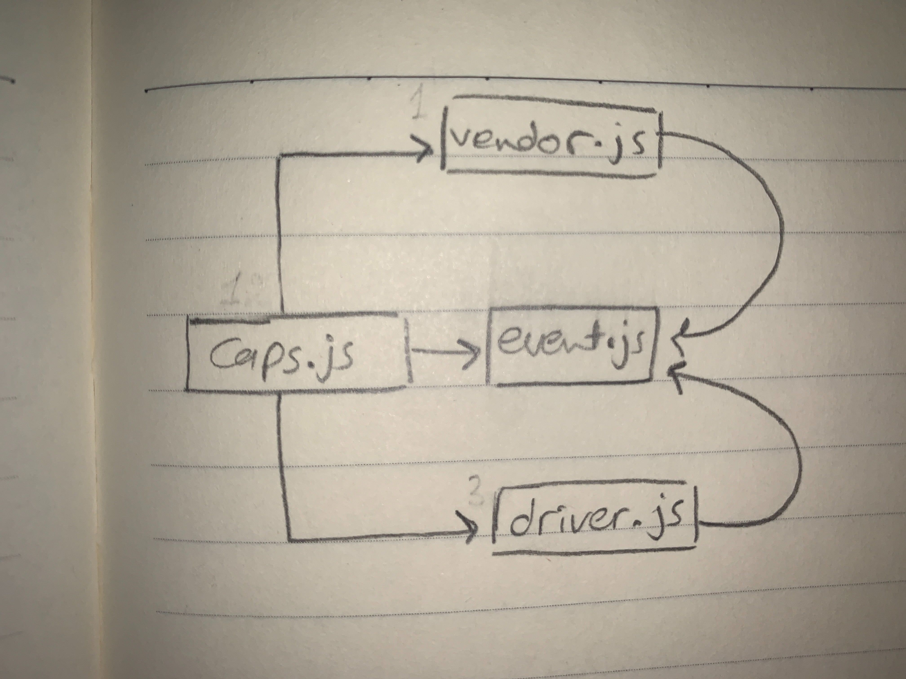

# caps

# LAB - Class 16

# Author: 
  -  Amal Almomani
# lab name
  - Event Driven Applications

## pull request link

  - [pull request](https://github.com/amal-401-advanced-javascript/caps/pull/1)

## Links and Resources
  - [GET](http http://localhost:3000/users)
  - 

## Setup
  - .env requirements
    - `MY_STORE_NAME`

## How to use your library 
  - npm i dotenv  
  - npm i faker
  - events

## How to initialize/run your application
  - nodemon
  - node events.js
  
## Tests
  - npm i -D jest => jest
  - npm test

## UML
 - 

 
